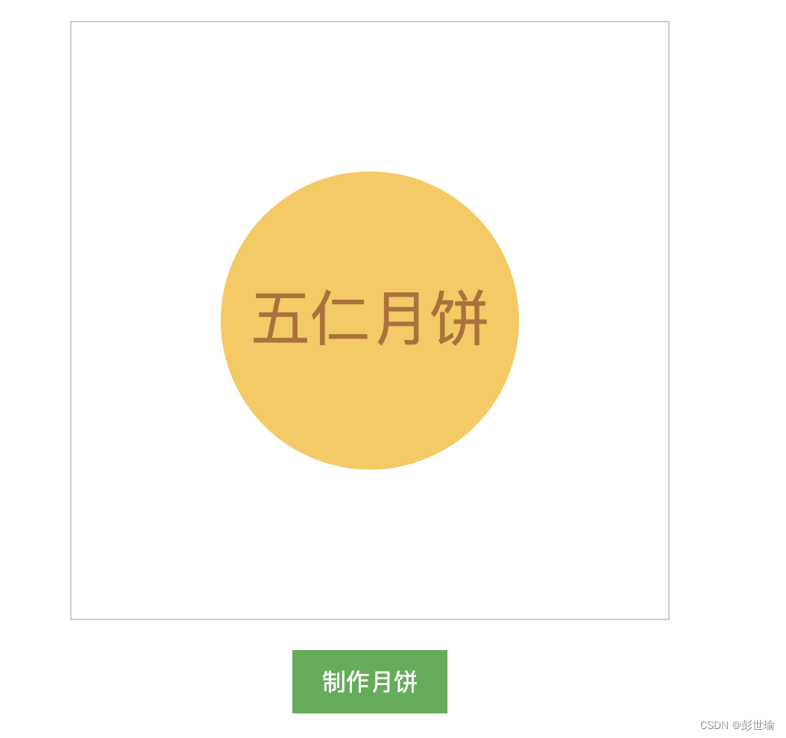

# MoonCake



在线制作中秋月饼

言简意赅，我主要分享一下思路

体验基于vite.js + vue3.js 的快速开发过程，并将代码发布到github

技术方案

- vite.js： [https://vitejs.dev/](https://vitejs.dev/)
- vue3.js: [https://cn.vuejs.org/index.html](https://cn.vuejs.org/index.html)
- fabric.js: [http://fabricjs.com/](http://fabricjs.com/)
- FileSaver.js [https://www.npmjs.com/package/file-saver](https://www.npmjs.com/package/file-saver)

开始项目

```bash
pnpm create vite
```

选择vue模板

核心代码
```html
<template>
  <div class="app">
    <div class="canvas-warp">
      <canvas
        width="400"
        height="400"
        id="canvas"
      ></canvas>
    </div>

    <button
      style="margin-top: 20px"
      class="button"
      @click="handleExportClick"
    >
      制作月饼
    </button>
  </div>
</template>

<script>
// created at 2022-08-23
import { fabric } from 'fabric'
import FileSaver from 'file-saver'

export default {
  name: 'App',

  props: {},

  components: {},

  data() {
    return {
      canvas: null,
    }
  },

  computed: {},

  methods: {
    async getData() {},

    // 导出为图片
    handleExportClick() {
      let base64 = this.canvas.toDataURL('png')
      FileSaver.saveAs(base64, 'mooncake.png')

      // 输出 png 图片可能会打断 canvas 的渲染
      this.canvas.requestRenderAll()
    },
  },

  mounted() {
    const canvas = new fabric.Canvas('canvas', {
      preserveObjectStacking: true, // 被选中时保持原有层级
      // selection: false,
    })
    // canvas.selection = false

    // 绘制一个圆
    const circle = new fabric.Circle({
      // top: 100,
      // left: 100,
      radius: 100, // 圆的半径 50
      fill: 'rgb(250,201,81)',
    })

    canvas.add(circle)

    circle.viewportCenter()

    // 绘制月饼馅
    const text = new fabric.Textbox('五仁月饼', {
      fill: 'rgb(180,110,48)',
    })
    canvas.add(text)

    text.viewportCenter()

    this.canvas = canvas
    // console.log(canvas.getObjects())
  },

  created() {
    this.getData()
  },
}
</script>

<style lang="less"></style>

<style lang="less" scoped>
.app {
  text-align: center;
}

.canvas-warp {
  border: 1px solid #ccc;
  box-sizing: border-box;
}

#canvas {
  width: 100%;
  height: 100%;
}

@media only screen and (max-width: 768px) {
  .app {
    padding: 0 8px;
  }

  .button {
    width: 80%;
    padding: 20px 0;
    font-size: 1.5rem;
  }

  .canvas-warp{
    padding: 10px;
  }
}
</style>

```

整体不难，调用Fabric.js 的接口，绘制一个基本的圆，就是月饼，再绘制一个文字，就完成了月饼的制作。

Fabric.js还提供了编辑功能，可以将文字修改为你想要的月饼馅，然后导出图片，直接将绘制完成的月饼下载到本地，发给你想要送月饼的人即可。

最后还通过github提供的github Actions 自动将提交的代码打包发布到github page。

这样就完成了项目创建到打包发布的完整过程。

源码：[https://github.com/mouday/moon-cake](https://github.com/mouday/moon-cake)

在线体验制作月饼：[https://mouday.github.io/moon-cake/](https://mouday.github.io/moon-cake/)

> 参考文章
> Fabric.js 从入门到________:
https://juejin.cn/post/7026941253845516324#heading-15
> Canvas如何做款祝福月饼【中秋特别版】
https://juejin.cn/post/7005356616685977630
> CSS 按钮 
https://www.runoob.com/css3/css3-buttons.html